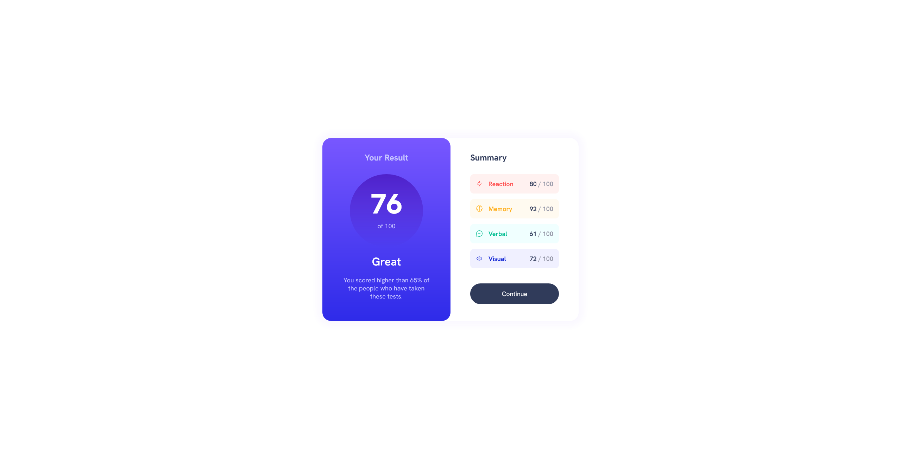

# Frontend Mentor - Results summary component solution

This is a solution to the [Results summary component challenge on Frontend Mentor](https://www.frontendmentor.io/challenges/results-summary-component-CE_K6s0maV). Frontend Mentor challenges help you improve your coding skills by building realistic projects. 

### Screenshot
Desktop layout:

Mobile layout:

### Links

- Live Site URL: https://available-username-it-is.github.io/responsive-summary-component/

### Built with

- Semantic HTML5 markup
- Flexbox
- CSS Grid
